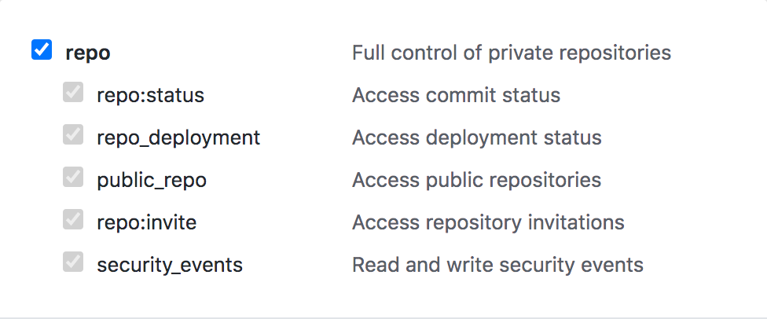
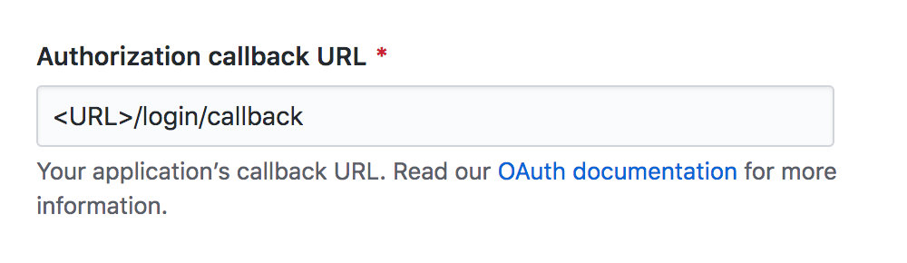
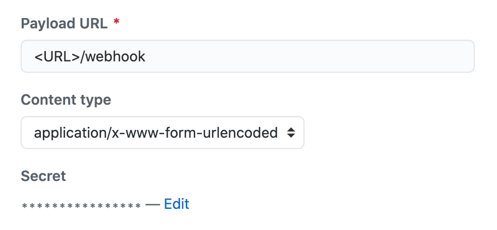

<div align="center">
  
  <br>
  <br>
</div>

> A single-user private Composer repository

Faction is a [Composer](https://getcomposer.org/) repository generator based on [Satis](https://github.com/composer/satis) and [Laravel](https://laravel.com/), designed to be paired with a GitHub organization.

It features

- a single GitHub organization/package vendor repository
- a sleek, high-performance web frontend
- grouping of packages by prefix
- an endpoint for organization-wide GitHub webhooks
- several layers of authentication: IP whitelist, GitHub OAuth app which verifies organization membership (for browser access) and HTTP basic auth with a GitHub access token which also checks organization membership (for access via Composer)

---

Faction is **not** a package repository management UI. It is fully managed through webhooks and a CLI, the browser-facing UI is just an enhanced, read-only presentation layer.

For a full management UI, take a look at [Satisfy](https://github.com/ludofleury/satisfy) or — even better — get the full Packagist UI (while also supporting the development of the Composer ecosystem) by obtaining a [Private Packagist](https://packagist.com/) account.

---

**Table of Contents:**

- [Setup](#setup)
  - [Requirements](#requirements)
  - [Preparation](#preparation)
  - [Installation](#installation)
  - [Configuration](#configuration)
  - [Set up the Queue Worker](#set-up-the-queue-worker)
  - [Import Packages](#import-packages)
- [Usage](#usage)
  - [Frontend](#frontend)
  - [Manage Packages](#manage-packages)
  - [Update Faction](#update-faction)
- [Concepts & Technology](#concepts--technology)
  - [Package Groups](#package-groups)
  - [Authentication](#authentication)
  - [Caches](#caches)
  - [Queue Worker](#queue-worker)
  - [IDE Helpers](#ide-helpers)

## Setup

These are the steps to take to set up a Faction app in production mode.

### Requirements

- Git
- PHP 7.4
- Node.js 10
- Composer
- Apache web server with `mod_rewrite` or comparable setup

### Preparation

- Plan for a URL to go with. It will be referenced as `<URL>` throughout these instructions.
- Create a GitHub personal access token for your Faction instance, ideally with the organization's admin account. Required scopes is everything related to `repo`:

  

- If you need to limit access to members of certain GitHub organizations, create an OAuth app in your GitHub organization settings. Set the "Authorization callback URL" to the `/login/callback` endpoint of your Faction instance:

  

- Create an organization-wide webhook in your GitHub organization settings pointing to the `/webhook` endpoint of your Faction app. Choose a secure, random secret and select the following individual events for the webhook:

  - Branch or tag creation
  - Branch or tag deletion
  - Pushes
  - Repositories

  

### Installation

1. Create an empty folder. Configure your webserver to point to the `/public` folder inside that path as the web root (&rarr; [Laravel docs](https://laravel.com/docs/7.x/structure#the-public-directory)).

2. Install Faction inside the empty folder with the following Composer command:

   ```bash
   composer \
     create-project\
     loilo/faction\
     .\
     --repository='{"url": "https://github.com/loilo/faction.git", "type": "vcs"}'\
     --stability=dev\
     --keep-vcs
   ```

### Configuration

Run the setup command. It will guide you through a Q&A to pre-fill your `.env` file:

```bash
php artisan faction:setup
```

After that, go through your `.env` file to possibly adjust non-essential things (e.g. app name, timezone, whitelisted IP addresses, ...)

You may also want to define [groups of packages](#package-groups) in your `config/app.php` file.

### Set up the Queue Worker

Run the following command as a service (or in any other auto-starting and auto-restarting monitoring software). Remember to replace `php`/`artisan` with absolute paths to your PHP binary/the `artisan` file in your Faction installation:

```bash
php artisan queue:work --sleep=3 --tries=3 --queue=satis,frontend,readme
```

There is a prepared [supervisord](https://supervisord.org/) configuration file in this repository ([`composer-repo-queue.conf.example`](composer-repo-queue.conf.example)) as well as a [systemd](https://en.wikipedia.org/wiki/Systemd) configuration file ([`composer-repo-queue.service.example`](composer-repo-queue.service.example)). You can adjust those for your use case.

### Import Packages

Run the following command to scan all your GitHub organization's packages:

```bash
php artisan faction:scan-org
```

Depending on the number of repositories and tags to scan, this may take some minutes or up to several hours.

Be aware that a very long-running scan process may exceed your access token's API request limit. If it does, the command will tell you so and suggest to input a new access token. You may follow that request or abort the initialization process and restart it once your quota has reset. Packages already scanned will be kept so that the command will eventually finish after a couple of attempts.

## Usage

### Frontend

The Faction frontend does not read the Satis-generated JSON files directly but runs on a SQLite based cache. This cache needs to be warmed first by running:

```
php artisan faction:rebuild-frontend --immediate
```

This is done automatically when packages are updated.

### Manage Packages

New packages in your organization are automatically registered in Faction through the according webhook. However, you can manually add/update/remove packages through the CLI:

```bash
php artisan faction:add-package [repo-name] --immediate
php artisan faction:update-package [package-name] --immediate
php artisan faction:remove-package [package-name] --immediate
```

### Update Faction

At this time, Faction does not have an elaborate version system. You need to pull the latest changes from GitHub for this and execute some extra steps.

This can be done with the `self-update` Composer script:

```php
composer run-script self-update
```

## Concepts & Technology

### Package Groups

Faction supports collecting packages in configured groups. The affiliation with a group is defined through package name prefixes.

This feature is basically a workaround to GitHub lacking a proper way to organize packages (e.g. in folders).

Groups are configured as `package_groups` in the [`config/app.php`](config/app.php) configuration file.

### Authentication

Faction provides three levels of authentication it handles in order. As soon as a user can be identified through one process, the following ones are skipped and the user may proceed:

1. **No Authentication:** You may declare your package repository as `PUBLIC` in your `.env` file. This will give read access to everyone.

   However, this option is directed to developers working on Faction. When your stuff may be publicly accessible, hosting it on [Packagist](https://packagist.org/) is almost always the better approach.

2. **IP whitelist:** It is possible to define a set of IP addresses or CIDR subnets as `AUTH_IP_WHITELIST` in the `.env` file. This can be useful to allow access without further checks from within a network.
3. **GitHub OAuth/Access Token:** Faction can handle authentication through a GitHub OAuth app you're providing it with. This requires the user to log in with a GitHub account and checks their org memberships against an orgs whitelist you provide as `AUTH_GITHUB_ORGS_WHITELIST` in your `.env` file.

   Since Composer cannot go through an OAuth login process, the Faction endpoints providing raw package data can be accessed with HTTP basic auth and a GitHub personal access token. Org membership is checked for this as well.

### Caches

There are various caches backing Faction's frontend. Whenever a "database-backed" cache is cited, it refers to Faction's SQLite database.

There is:

- a **database-backed package cache** which grants performant access to the raw data displayed in the frontend. (This cache is _not_ used for access through Composer.) This can be cleared through:

  ```bash
  php artisan faction:rebuild-frontend --immediate
  ```

  This is usually fast enough, but it may be useful to know that this command actually fully wipes and rebuilds the package database.

- a **database-backed response cache**. Since the Faction frontend is (apart from the authentication part) stateless, plain HTML responses can be cached indefinitely until a package or faction itself is updated.

  This cache is only cleared partially when a package is updated. To wipe it fully, run:

  ```bash
  php artisan response:clear
  ```

- a **file-based, general-purpose cache**. Any package metadata may be stored here since this kind of data is immutable between package updates.

  On package update, this cache is cleared, which can also be done manually through the following command:

  ```bash
  php artisan cache:clear
  ```

### Queue Worker

Rebuilding the frontend of the website when a package reports a change may take some seconds — which means that multiple webhook events may interfer with each other.

To avoid this, the webhook endpoint executes its work as [queued jobs](https://laravel.com/docs/7.x/queues).

#### Queues

There is not one but three queues in Faction which all run on the same worker process. They are assigned different priorities and executed in the order listed below:

1. **`satis`:** This executes the necessary Satis tasks for adding, removing or updating packages.
2. **`frontend`:** This clears and rebuilds the caches holding the Faction frontend. When a jobs is added to this queue, all queued (and not currently executing) `frontend` jobs are cancelled.
3. **`readme`:** When a package broadcasts itself being updated through a webhook, Faction will try to re-scan its readme if necessary. This is some kind of eager evaluation which would be done anyway as soon as someone opens the readme, therefore its priority is lowest.

#### Development

When `APP_ENV` is set to `local`, the `QUEUE_CONNECTION` runs in `sync` by default, because there is no risks of any colliding webhooks.

To test queues, you may enable them by manually setting `QUEUE_CONNECTION=database` in the `.env` configuration and start the queue worker in your terminal:

```bash
php artisan queue:work --sleep=3 --tries=3 --queue=satis,frontend,readme
```

### IDE Helpers

For developer convenience, Faction uses [IDE helpers](https://github.com/barryvdh/laravel-ide-helper) for Laravel. If you're working on Faction source code, remember to run

```bash
php artisan ide-helper:generate
php artisan ide-helper:models --nowrite
```

once in a while to keep helpers up to date.
